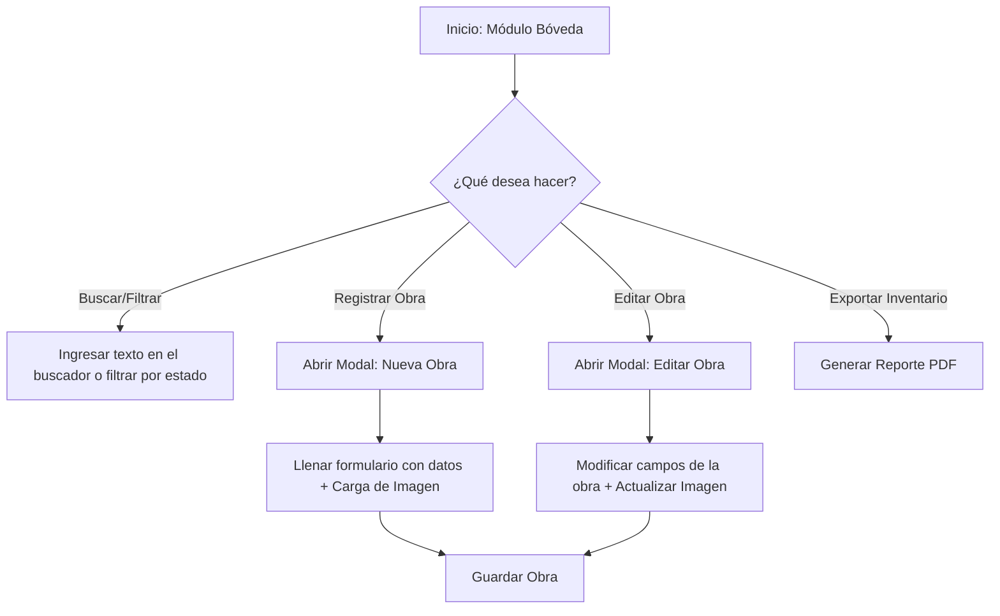
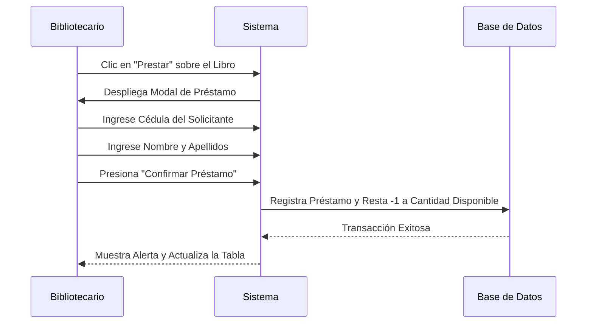
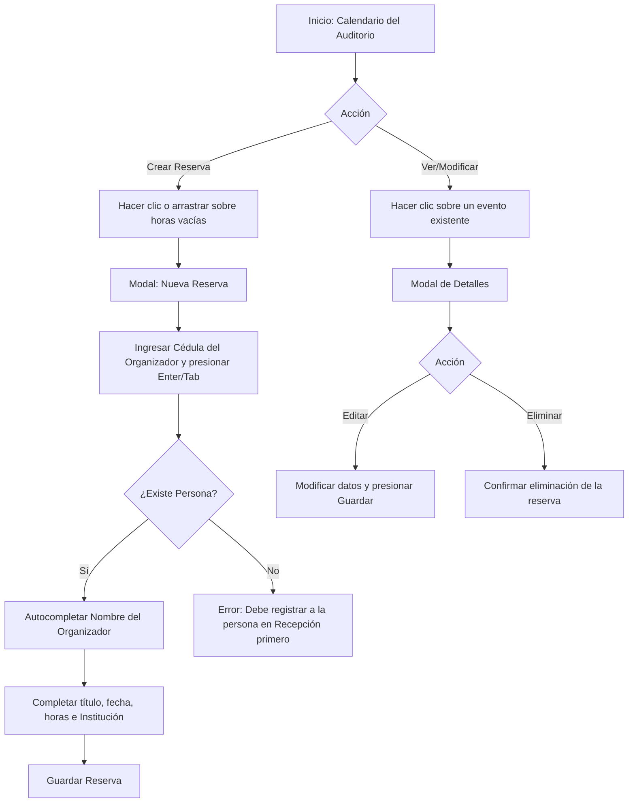
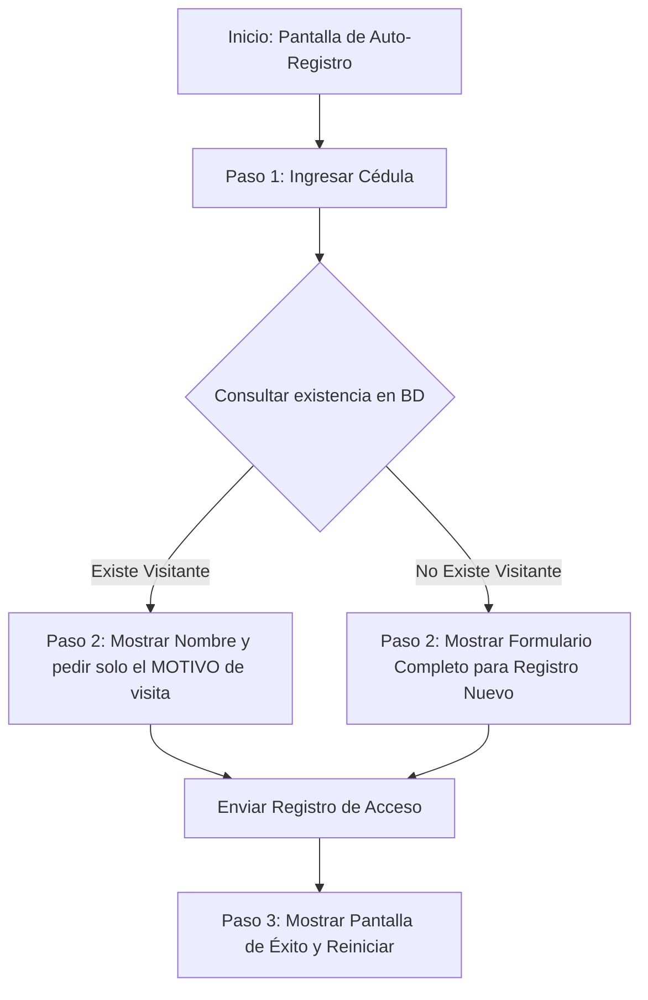

# Manual de Usuario - Sistema de Gestión MAVET
## Museo de Artes Visuales y del Espacio del Táchira

Bienvenido al **Manual de Usuario del Sistema de Gestión del Museo MAVET**. Este documento detalla minuciosamente el funcionamiento de cada módulo de la aplicación web, explicando de manera secuencial los procesos, la lógica de validación interna, los roles de acceso, y los flujos paso a paso para operar el sistema óptimamente basándose en la implementación real del proyecto.

---

## Tabla de Contenido
1. [Introducción y Objetivos](#1-introducción-y-objetivos)
2. [Arquitectura de Acceso, Autenticación y Roles](#2-arquitectura-de-acceso-autenticación-y-roles)
3. [Panel Principal / Dashboard](#3-panel-principal--dashboard)
4. [Inventario de Bóveda (Obras de Arte)](#4-inventario-de-bóveda-obras-de-arte)
5. [Biblioteca del Museo](#5-biblioteca-del-museo)
6. [Recursos Humanos (RRHH) y Control de Asistencia](#6-recursos-humanos-rrhh-y-control-de-asistencia)
7. [Control de Recepción (Taquilla)](#7-control-de-recepción-taquilla)
8. [Área Educativa: Talleres de Formación](#8-área-educativa-talleres-de-formación)
9. [Área Educativa: Reservas del Auditorio](#9-área-educativa-reservas-del-auditorio)
10. [Módulos de Registro de Ingreso y Asistencia (Uso Público)](#10-módulos-de-registro-de-ingreso-y-asistencia-uso-público)
    * [Auto-Registro Público de Visitantes](#auto-registro-público-de-visitantes)
    * [Reloj de Asistencia de Personal](#reloj-de-asistencia-de-personal)
11. [Perfil del Usuario Autenticado](#11-perfil-del-usuario-autenticado)

---

## 1. Introducción y Objetivos

El Sistema de Gestión del **Museo MAVET** es una plataforma integrada de control administrativo diseñada para unificar la gestión del patrimonio artístico, bibliográfico, humano e interactivo del museo. Sus principales objetivos son:
* **Digitalizar e inventariar** las piezas resguardadas en la Bóveda del museo.
* **Controlar el flujo de préstamos** de libros en sala de la Biblioteca.
* **Gestionar el talento humano** mediante seguimiento de asistencia, asignación de cuentas de acceso y emisión de cartas avales de horas.
* **Registrar las visitas del público** general (presencialmente o de forma autónoma) a fin de generar métricas de afluencia e ingresos.
* **Administrar eventos académicos/culturales** y talleres escolares y comunitarios en las instalaciones.

---

## 2. Arquitectura de Acceso, Autenticación y Roles

El acceso al panel administrativo está protegido y requiere credenciales válidas.

### Proceso de Inicio de Sesión (Sign In)
1. Ingrese a la ruta `/signin`.
2. Escriba su dirección de correo electrónico institucional y la contraseña asignada.
3. Presione el botón **"Iniciar Sesión"**. 
4. Si los datos son correctos, el sistema almacena de forma segura su token de sesión (`JWT`) en `localStorage` (bajo la clave `token`) y la información del usuario (`user`), y le redirige automáticamente al **Panel Principal**.
   > [!NOTE]
   > Un interceptor de Axios adjunta automáticamente el token en cada petición en la cabecera `Authorization: Bearer <token>`. Un error 401 del servidor cerrará la sesión de forma inmediata.

### Proceso de Registro de Nuevos Administradores (Sign Up)
1. Para dar de alta a nuevos usuarios autorizados, diríjase a la ruta `/signup`.
2. Complete los campos requeridos: Nombre completo, Correo electrónico, Contraseña y confirmación.
3. Presione **"Registrarse"**.
   > [!IMPORTANT]
   > Todo usuario creado por esta vía debe ser asociado posteriormente a un trabajador activo y asignársele su respectivo rol de operación en la sección de RRHH para poder ejecutar transacciones según su perfil de trabajo.

### Matriz de Roles y Niveles de Acceso
El sistema cuenta con un control de accesos basado en roles (RBAC). Cabe destacar que los roles **Administrador**, **admin** y **Gerente** actúan como superusuarios y omiten todos los controles de acceso de las páginas, pudiendo visualizar y modificar cualquier sección.

| Rol de Usuario | Permisos / Módulos Habilitados |
| :--- | :--- |
| **Administrador (`admin` / `Administrador`) / Gerente** | Acceso total y sin restricciones a todos los módulos, reportes y configuraciones del sistema. *(Nota: El rol de Gerente no puede gestionar la pestaña de creación de usuarios en RRHH)*. |
| **Curador** | Acceso al **Inventario de Bóveda** (`/inventario-obras`) para lectura, registro y edición de obras de arte. |
| **Bibliotecario** | Acceso operativo al módulo **Biblioteca** (`/biblioteca`) para ingresar textos, registrar préstamos y devoluciones. |
| **Recepcionista** | Acceso al módulo **Recepción** (`/recepcion`) para control diario de taquilla, búsqueda de personas y la pantalla estadística `/ingresos`. |
| **Educación** | Control total de las secciones de **Talleres** (`/talleres`), **Auditorio** (`/auditorio`), y la sección integrada `/educacion`. |

---

## 3. Panel Principal / Dashboard (`/`)

El Dashboard ofrece una vista panorámica en tiempo real de las actividades del museo. Está diseñado con métricas interactivas y gráficos dinámicos que se actualizan automáticamente al ingresar al sistema.

### Elementos Clave del Dashboard:
1. **Métricas Globales (Tarjetas de Totales):**
   * **Obras en Bóveda:** Total general de piezas de arte registradas. Muestra un porcentaje comparativo de incremento.
   * **Títulos en Biblioteca:** Volumen total de ejemplares catalogados en biblioteca.
   * **Visitantes del Mes:** Contador dinámico del número total de ingresos de personas del mes en curso.
   * **Eventos Programados:** Cantidad de reservas activas o aprobadas para el Auditorio durante la semana/mes.
2. **Gráficos Estadísticos:**
   * Gráficas de barra y lineales interactivas (desarrolladas con ApexCharts) que ilustran la afluencia mensual de visitantes y los motivos de visita (estudio, turismo, recreación, talleres).
3. **Acceso Rápido:**
   * Enlaces directos a los principales reportes y módulos del museo en el menú lateral desplegable.

---

## 4. Inventario de Bóveda (Obras de Arte) (`/inventario-obras`)

Este módulo está destinado a los curadores del museo para el control detallado del patrimonio artístico.

### Proceso de Registro de una Nueva Obra:
1. Haga clic en el botón **"+ Agregar Obra"** (o **"+ Registrar Obra"** en la cabecera). Se desplegará un formulario modal.
2. Complete la información obligatoria del formulario:
   * **Código de Inventario:** Código único de control asignado a la pieza (Ej: `MAVET-OB-2026-004`).
   * **Título:** Nombre de la obra.
   * **Artista / Autor:** Selección en la lista desplegable de artistas registrados.
   * **Técnica:** Técnica utilizada (Óleo, acrílico, acuarela, escultura, etc.).
   * **Categoría:** Categoría de la obra de arte.
   * **Ubicación:** Ubicación física de la obra dentro del museo o bóveda.
   * **Tipo de Ingreso:** Donación, Adquisición, Comodato, Custodia.
3. Complete los campos complementarios:
   * **Año:** Año de creación de la obra (el año por defecto es el actual).
   * **Medidas:** Dimensiones de la obra (Ej: `120 x 80 cm`).
   * **Piezas:** Cantidad de partes físicas que integran la obra (por defecto `1`).
   * **Peso:** Peso aproximado (en kg), opcional.
   * **Estado de Conservación:** Selección del estado de la pieza de arte.
   * **Descripción:** Comentarios analíticos sobre la obra o detalles de interés histórico.
4. **Carga de Imagen (Fotografía de la Obra):** Haga clic sobre el recuadro de carga para subir un archivo fotográfico (formatos soportados: JPG, PNG).
5. Haga clic en el botón **"Guardar Obra"**. El sistema actualizará el listado y la cuadrícula de inmediato.

### Proceso de Edición y Eliminación:
* **Para Editar:** Ubique la obra y haga clic en el botón de edición (icono de lápiz). Se abrirá el formulario cargado con los datos correspondientes. Aplique los cambios y guarde.
* **Para Eliminar:** Haga clic en el botón de eliminar (icono de papelera) sobre la fila correspondiente. Confirme la advertencia en pantalla.
  > [!CAUTION]
  > La eliminación de una obra es permanente e irreversible en la base de datos central. Solo los usuarios con rol de Administrador, admin y Gerente tienen permitido eliminar obras.

### Exportar el Inventario a PDF:
* Presione el botón **"Exportar PDF"** ubicado en la cabecera del módulo. El sistema procesará el inventario actual y descargará automáticamente un reporte consolidado con el formato formal de la institución.

---

## 5. Biblioteca del Museo (`/biblioteca`)

Módulo encargado de catalogar los textos del museo y administrar el flujo de préstamos de sala de lectura diarios.

### Proceso de Registro de Libros (CRUD)
1. Haga clic en **"+ Registrar Nuevo Libro"**.
2. Rellene los campos del formulario modal:
   * **Título** del libro (Obligatorio).
   * **Autor (Nombre y Apellido)** del libro (Obligatorio el nombre).
   * **Unidad / Cuota:** Identificador decimal y número de catalogación de la biblioteca (este último se muestra autocalculado o de lectura en edición).
   * **Categoría:** Clasificación del libro. Se puede seleccionar una categoría existente o elegir una nueva ingresando el texto descriptivo correspondiente.
   * **Estante:** Ubicación física del texto en la biblioteca.
   * **Cantidad Total:** Número de copias físicas iniciales registradas en biblioteca.
3. Guarde para actualizar el catálogo.

### Paso a Paso para Registrar un Préstamo de Lectura en Sala

1. Ubique el libro solicitado en la tabla de biblioteca. Verifique que queden unidades disponibles en la columna de cantidad.
2. Presione el botón **"Prestar"** (icono de entrega).
3. En el formulario modal:
   * Escriba la **Cédula del Solicitante** (lector).
   * Escriba el **Nombre** del solicitante.
4. Presione **"Confirmar Préstamo"**.
   * *Operación interna:* El sistema descontará automáticamente una unidad en `cantidad_disponible` de ese libro y marcará el préstamo como **ACTIVO**.

### Paso a Paso para Registrar la Devolución de un Libro
1. En el listado de préstamos activos (pestaña de préstamos):
2. Ubique el préstamo por el nombre o cédula del lector.
3. Presione el botón **"Devolver"** en la fila del registro correspondiente.
4. Confirme la devolución física del libro.
   * *Operación interna:* El sistema marcará la transacción como concluida e incrementará automáticamente la `cantidad_disponible` del libro en `+1`.

---

## 6. Recursos Humanos (RRHH) y Control de Asistencia (`/rrhh`)

Este panel modular consolida tres pestañas operativas esenciales para la gestión de personal del museo. *(Nota: El rol de Gerente no puede visualizar ni acceder a la pestaña de Usuarios)*.

### Pestaña 1: Trabajadores (Gestión de Personal)
* **Registro de Trabajadores:** Permite registrar empleados completando cédula, nombres, apellidos, teléfono, correo personal, cargo (Director, Curador, Guía, Administrativo, etc.), horas de servicio requeridas semanalmente, fecha de nacimiento, fecha de ingreso, dirección, estado (Activo/Inactivo) y carga de foto de perfil con compresión de imagen integrada.
* **Generación de Códigos QR (Carnet):** 
  Al guardar a un trabajador, el sistema genera automáticamente un **Código QR único** basado en un identificador encriptado.
  * **Exportación del Carnet:** Haga clic en el botón de exportación sobre el trabajador para descargar un PDF formal del carnet que incluye el Código QR. Este código permite el escaneo rápido en el control de asistencia.
* **Carta Aval de Horas:** Para pasantes o personal de servicio comunitario, permite generar un PDF oficial que detalla y consolida las horas acumuladas mediante los registros de asistencia registrados en el sistema.

### Pestaña 2: Control de Asistencia (Historial de Entradas/Salidas)
* Muestra un histórico detallado de los movimientos de asistencia del personal. 
  * **Estructura de la Tabla:** Contiene las columnas: *Fecha*, *Cédula*, *Nombre y Apellido*, *Cargo*, *Entrada* (en color verde), *Salida* (en color rojo), *Horas* y *Observaciones*.
  * **Formato de Horas:** El total de horas cumplidas se muestra formateado automáticamente de manera amigable (Ej: `2h 30min` o `45 min`) en lugar de números decimales crudos.
  * **Formato de Marcaciones:** Las horas de entrada y salida se muestran utilizando el formato de hora local venezolano (`es-VE`).
* Permite buscar por nombre o cédula y paginar los resultados.
* **Exportación de Reporte:** El botón **"Exportar Asistencia PDF"** genera un archivo PDF formal con la tabla completa de registros de asistencia para su entrega a la dirección administrativa.

### Pestaña 3: Gestión de Usuarios del Sistema (Cuentas de Acceso)
* Aquí el administrador de RRHH crea y gestiona las cuentas que permiten iniciar sesión en el panel.
* **Formulario de Usuario:**
  * **Trabajador Vinculado:** Selección del empleado registrado al que pertenece la cuenta.
  * **Correo y Contraseña:** Credenciales exclusivas de ingreso (la contraseña debe tener al menos 6 caracteres).
  * **Rol del Sistema:** Asignación del rol funcional (Admin, Curador, Bibliotecario, etc.) que determina qué módulos podrá visualizar al iniciar sesión.
  * **Acciones:** Permite activar/desactivar cuentas de usuario y cambiar o reestablecer contraseñas de acceso.

---

## 7. Control de Recepción (Taquilla) (`/recepcion`)

Módulo de uso exclusivo para el personal de taquilla o recepción ubicado en la entrada principal del museo.

### Operación Paso a Paso del Registro de Visitantes:
1. **Búsqueda Rápida de Visitantes (Buscador Global):**
   * Al llegar una persona a la taquilla, el recepcionista digita los primeros caracteres del nombre, apellido o la cédula en el buscador de la cabecera y presiona Enter o **"Buscar"**.
2. **Si el Visitante ya existe en el Historial:**
   * Haga clic sobre su registro en los resultados de búsqueda. El sistema rellenará automáticamente los campos del formulario con sus datos registrados (Cédula, Nombres, Apellidos, Teléfono, Nacimiento).
   * **Alerta Automática de Edad (Menores de Edad):** Si el visitante anteriormente fue registrado como menor de edad (sin cédula) pero ya cumplió los **9 años**, el sistema arrojará una alerta restrictiva:
     > [!WARNING]
     > "Esta persona ya cumplió 9 años. Por favor, actualice su cédula real."
     El recepcionista deberá ingresar y guardar la nueva cédula del menor.
3. **Si el Visitante es Nuevo:**
   * Digite de forma manual todos sus datos en el formulario lateral (Cédula, Nombres, Apellidos, Teléfono, Fecha de Nacimiento, Institución/Profesión).
4. **Registro del Motivo de Visita:**
   * Seleccione el **Motivo de la visita** (Turismo, Actividad Cultural, Investigación, Taller, Recorrido Guiado, etc.).
   * **Visita Institucional:** Si el visitante es un representante institucional, puede activar el interruptor de visita institucional para ingresar la **Cantidad de acompañantes** que viajan con él.
5. Presione **"Registrar Acceso"**.

### Registro Especial de Menores de Edad (Niños en Visita Escolar o Familiar)
1. Para registrar la entrada de niños sin cédula que acompañen a un adulto, primero busque y seleccione al adulto acompañante (Representante).
2. Con el representante seleccionado, haga clic en el botón **"Registrar Menor Acompañado"**.
3. Se abrirá un modal flotante. Complete:
   * Nombres y Apellidos del niño/a.
   * Fecha de Nacimiento.
4. Presione **"Guardar Menor"**.
   * *Lógica interna:* El sistema guardará el acceso enlazando al menor con el ID del representante seleccionado (`id_representante_persona`), permitiendo generar estadísticas demográficas exactas.

### Generar QR Público y Asistencia
* **Generar QR Público:** Muestra un modal con un código QR que apunta a la URL pública de auto-registro (`/registro-visitante`) para que las personas puedan escanearlo con sus teléfonos móviles y registrarse de forma autónoma. Permite descargar el QR en formato PDF.
* **Asistencia Personal:** Abre el modal de registro de asistencia de personal para que los trabajadores que pasen por taquilla puedan firmar su entrada/salida directamente (ver Sección 10).

---

## 8. Área Educativa: Talleres de Formación (`/talleres`)

Este módulo controla la oferta de talleres académicos y de arte impartidos por el museo MAVET.

### Proceso de Creación o Planificación de un Taller:
1. Haga clic en el botón **"Planificar Taller"** (o en la sección de talleres correspondientes).
2. En el formulario modal, complete:
   * **Nombre del Curso:** Selección del curso del catálogo o inventario de talleres.
   * **Instructor:** Seleccione el docente a cargo en la lista desplegable.
   * **Espacio:** Aula o área del museo donde se dictará (Ej: *Taller A*, *Patio Central*).
   * **Sesiones y Horas Totales:** Frecuencia e intensidad horaria.
   * **Horarios:** Hora de inicio, hora de fin y fecha de arranque.
   * **Cupos:** Definición de cupo mínimo y cupo máximo para el control de admisiones.
3. Presione **"Planificar Taller"**.

### Inscripción de Estudiantes a los Talleres (Paso a Paso):
1. En la lista de talleres planificados, haga clic en el botón de opciones del taller correspondiente y elija **"Inscribir Alumno"**.
2. Complete el formulario en el modal de inscripción:
   * Seleccione el taller al que desea inscribir.
   * Ingrese el Nombre completo del Alumno y su Edad.
3. **Validación de Menores de Edad:**
   * Si la edad ingresada es **menor a 18 años** (`esMenor` se vuelve activo en base al número), el formulario activará dinámicamente campos adicionales obligatorios bajo la sección *Datos del Representante*.
   * Ingrese: Nombre del Representante, Cédula del Representante y Teléfono de Contacto.
4. Haga clic en **"Inscribir Alumno"**.
   * *Validación interna:* El sistema denegará la inscripción si se supera el cupo máximo definido del taller o si faltan datos del representante para menores de edad.

---

## 9. Área Educativa: Reservas del Auditorio (`/auditorio`)

El museo cuenta con un auditorio disponible para eventos públicos e institucionales. Su administración se gestiona mediante un calendario visual e inteligente.

### Operatoria del Calendario (FullCalendar)
* El calendario muestra tres tipos de visualización en pestañas superiores: **Mes**, **Semana** y **Día**.
* Las reservas aprobadas aparecen bloqueadas en la agenda con un color identificatorio según el tipo de evento.

### Proceso para Crear una Reserva:
1. Haga clic o arrastre el cursor sobre las horas y el día deseado directamente en el calendario. Se abrirá la ventana modal de reserva.
2. **Validación Inteligente de Cédula:**
   * Escriba la **Cédula del Organizador** del evento.
   * Haga clic fuera del campo (o presione Tabulación para disparar el evento *blur*).
   * **Búsqueda en background:** El sistema consultará de inmediato la base de datos de visitantes.
     * Si el organizador está registrado, su nombre aparecerá automáticamente en el campo de texto y se habilitará el formulario.
     * Si no se encuentra registrado en el sistema, aparecerá una alerta roja de error:
       > [!CAUTION]
       > "Persona no encontrada. Debe registrar su ingreso como visitante primero."
       Deberá pausarse la reserva y registrar primero los datos personales en el módulo de Recepción.
3. Complete los campos complementarios:
   * **Motivo/Título de la Reserva:** Nombre del evento (Ej: *Concierto de la Orquesta Sinfónica*).
   * **Tipo de Evento / Institución:** Indique la institución patrocinante u organizadora (Conferencia, Ensayo, Asamblea, etc.).
   * **Hora de Inicio y Fin:** Ajuste preciso de los bloques horarios.
4. Presione **"Guardar Reserva"**.

### Edición y Anulación de Reservas:
* Haga clic sobre el evento en el calendario.
* Edite la hora, fecha o título y presione **"Guardar"**.
* Si desea cancelar, presione el botón **"Eliminar Reserva"** en el pie del modal y confirme la acción.

---

## 10. Módulos de Registro de Ingreso y Asistencia (Uso Público)

El sistema provee interfaces adaptadas para pantallas de uso público o tablets en áreas de acceso general del museo.

### Auto-Registro Público de Visitantes (`/registro-visitante`)
Ubicado en un Kiosko o tablet en la recepción del museo para que los visitantes registren su ingreso de forma autónoma.

* **Flujo del Proceso en 3 Pasos:**
  * **Paso 1:** El visitante introduce su número de cédula en el campo central y presiona **"Siguiente"**.
  * **Paso 2 (Validación Inteligente):**
    * **Si el usuario ya ha visitado el museo antes:** El sistema lo reconoce, muestra un saludo personalizado con su nombre y le solicita únicamente seleccionar el **Motivo de su visita** (Turismo, Taller, Investigación, etc., incluyendo eventos de la agenda actual si coinciden con la fecha de hoy).
    * **Si es su primera visita:** El sistema despliega un formulario completo solicitando: Nombres, Apellidos, Teléfono, Fecha de Nacimiento e Institución o Profesión, además del Motivo de la visita.
  * **Paso 3:** Se muestra una pantalla con un check verde de confirmación de registro de ingreso ("¡Ingreso Registrado!"). Para volver a usar el terminal, se hace clic en el botón **"Registrar a otra persona"** lo que limpia la pantalla y vuelve al Paso 1.

---

### Reloj de Asistencia de Personal
Para registrar las entradas y salidas de los trabajadores del museo, existen dos modalidades disponibles. Cabe señalar que para registrar la asistencia de forma completamente funcional y automatizada, se utiliza la **Modalidad 2**:

#### Modalidad 1: Pantalla de Reloj de Trabajadores (`/ingresos`)
Es una pestaña de uso administrativo que ofrece:
1. **Pestaña Dashboard Visitantes:** Con los indicadores generales del día y el consolidado histórico de visitas.
2. **Pestaña Reloj de Trabajadores:**
   * Formulario de maquetación que dispone de un cuadro de texto para ingresar la cédula y botones para registrar entrada/salida.

#### Modalidad 2: Modal de Asistencia Automatizado y QR (`/recepcion` -> Asistencia Personal)
Este modal implementa un **flujo inteligente y dinámico** de validación de estado en segundo plano:
1. El recepcionista o empleado hace clic en el botón **"Asistencia Personal"** en la esquina superior derecha del panel de Recepción.
2. Se selecciona el método de identificación:
   * **Escanear QR (Por defecto):** Se activa la cámara para escanear el carnet QR generado en RRHH. Al detectarlo, el sistema realiza automáticamente una consulta al servidor.
   * **Ingreso Manual:** Se introduce la cédula del trabajador y se presiona **"Buscar"**.
3. **Validación Automática de Estado:** El sistema consulta el estado del trabajador a través del endpoint `/api/rrhh/asistencias/estado` y dibuja la interfaz dinámicamente:
   * Muestra el nombre completo y la cédula del empleado.
   * Muestra un panel con un listado interactivo con checkboxes de los registros de hoy (**Entrada** y **Salida**) y sus horas de marcación correspondientes en formato de 12 horas.
   * **Tiempo en jornada:** Si el trabajador ya marcó entrada y está cumpliendo jornada, el modal activa una sección de aviso en color naranja indicando el tiempo transcurrido (formato `Xh Ymin`) y la hora exacta desde la cual está activo.
4. **Marcación Dinámica (Botón Único Inteligente):** El usuario no tiene que decidir qué botón presionar, el sistema calcula de forma atómica su siguiente movimiento y habilita un botón único y centralizado:
   * Si no ha registrado entrada hoy: Se muestra el botón verde **"Registrar Entrada"**.
   * Si tiene entrada registrada pero no salida: Se muestra el botón rojo **"Registrar Salida"**.
   * Si ya completó ambos registros del día: Se deshabilita la acción y se muestra un panel gris indicando **"Jornada completa registrada - No hay más movimientos pendientes por hoy"**.
5. Al hacer clic en el botón inteligente habilitado, se registra el movimiento en base de datos, se muestra un mensaje de confirmación exitoso, y el modal se cierra de forma automática tras 2 segundos.

---

## 11. Perfil del Usuario Autenticado (`/profile`)

Cada administrador, curador, recepcionista o guía puede consultar la información de su cuenta de usuario en esta pestaña del panel lateral.

* **Datos Visibles:**
  * Nombre de usuario y dirección de correo electrónico institucional.
  * Cargo oficial dentro de la institución y rol de permisos asignado.
  * Estado de la cuenta de usuario.
* **Acciones:**
  * **Datos Personales:** Permite modificar el nombre, apellido, correo electrónico personal y teléfono vinculado.
  * **Seguridad:** Permite actualizar la contraseña de la cuenta tras verificar la clave actual (la nueva contraseña debe poseer al menos 6 caracteres).
  
  > [!WARNING]
  > **Nota de compatibilidad:** La sección para subir y actualizar la foto de perfil en `/profile` puede retornar un error **404** en consola al guardar, debido a que el endpoint `/api/auth/me/foto` no se encuentra implementado actualmente en el servidor backend.

---
*Fin del Manual de Usuario.*
*Dirección de Tecnología y Sistemas del Museo de Artes Visuales y del Espacio del Táchira (MAVET).*
